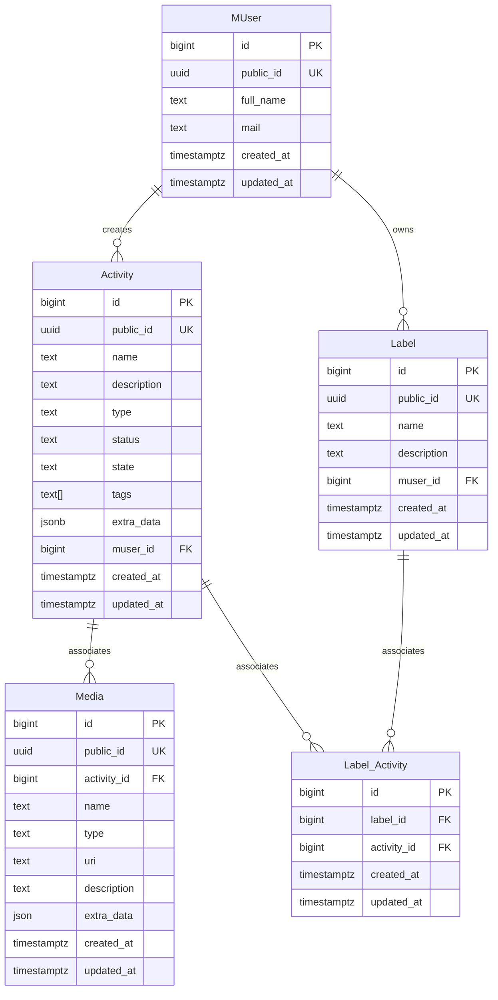

# Project TODO

## Architecture

## Datamodel

## Stack
### Services
* Java 19
* Spring Boot
### Authentication
* KeyCloak
  * OpenID Connect

### Database
* Postgress

#### Helpers
* Error handling
https://github.com/wimdeblauwe/error-handling-spring-boot-starter

### Testing
* Junit 5
* TestContainers 
* Gatling

### Observability
> (metrics, logs, traces, continuous profiling)
* Prometheus
* Grafana 
* Loki  
* Tempo 
* Pyroscope
* Postgres-exporter

## Web
* React

## Documentation:
* Asciidoctor

## Container
- Docker

## Future improvements
* Kafka and WebSockets
* Nginx
* JBang
* Thymeleaf + HTMX
* JDK FLight Recorder
* JDK Mission Control
* Visual VM 

## References
- https://spring.io/guides/topicals/spring-boot-docker/