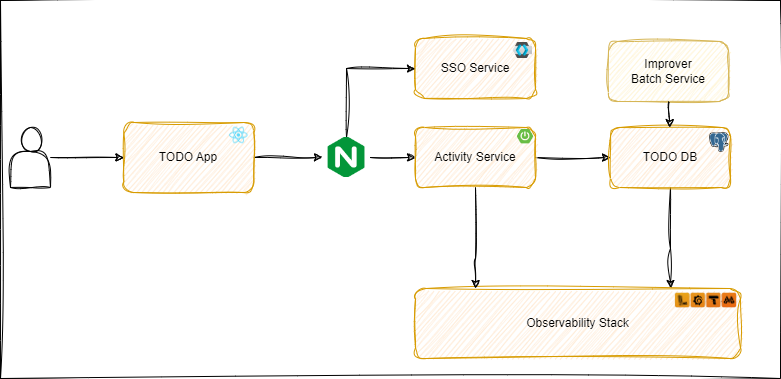

# Project TODO

## Architecture


## Datamodel


## Stack

### Activities Service
* Java 19
* Spring Boot
* Spring RestDocs
* Micrometer
* Zipkin
* Loki4j
* Pyroscope
* Slf4j 
* Maven
* GSon
* JJWT


### Identity Management
* KeyCloak (SSO)
  * OpenID Connect

### Database
* Postgress

## API Documentation
* Asciidoctor

## Container
* Docker

### Testing
* Junit 5 (Unit)
* TestContainers (Integration) 
* Gatling (Performance)

### Observability
> (metrics, logs, traces, continuous profiling)
* Prometheus
* Grafana 
* Loki  
* Tempo 
* Pyroscope
* Postgres-exporter

## Web Client
* React
* W3.CSS
* Babel
* Webpack
* Axios

### Commands

* Build
```
docker compose build
```

* Start:

```
docker compose up -d
```

* Run integration tests:

```
cd test
.\mvnw surefire:test
```

* Run performance tests:

```
cd .\performance\gatling\
.\mvnw gatling:test 
```

* API Documentation
```
cd .\todo-svc
.\mvnw package
```

### Info
* Home: http://localhost:3000/ 
  * User: test/123
* Grafana: http://localhost:3030/
  * User: admin/admin
  * Dashboards:
    * JVM (Micrometer)
    * Logs, Traces, Metrics
    * PostgreSQL Database
* Keycloak: http://localhost:8282/admin/
  * User: admin/admin
* PosgresSQL: localhost:5432
  * Database: todo
* API Docs
  * todo-svc\target\generated-docs\api-guide.html


